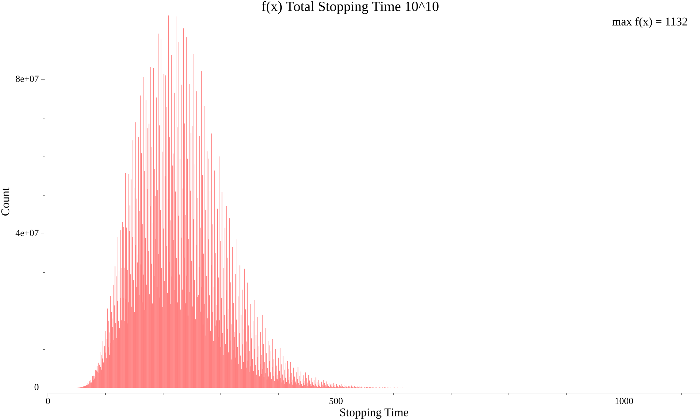
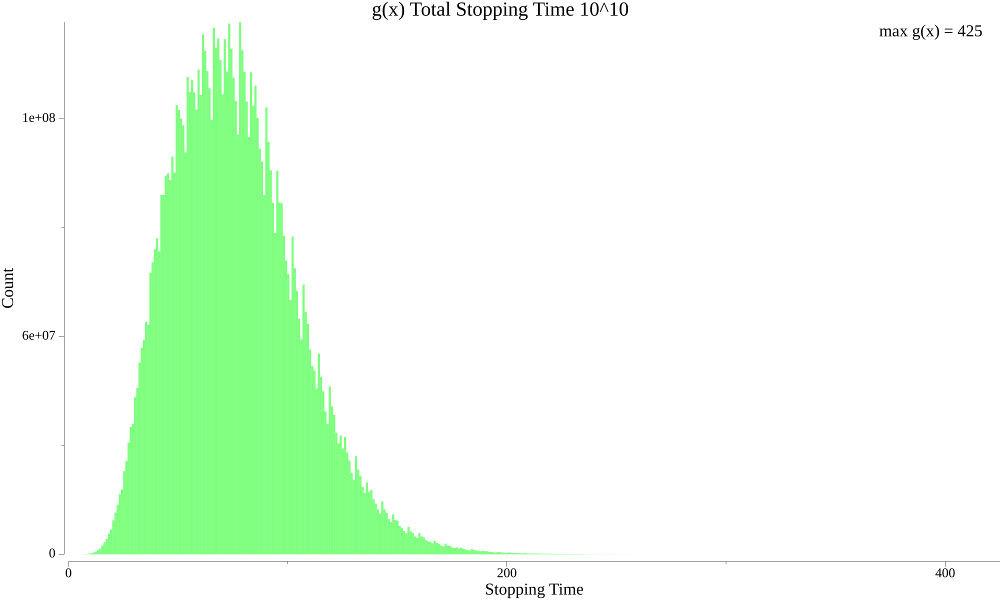
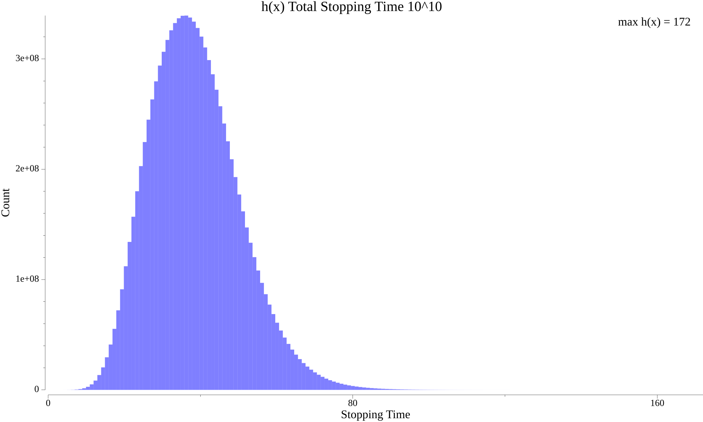
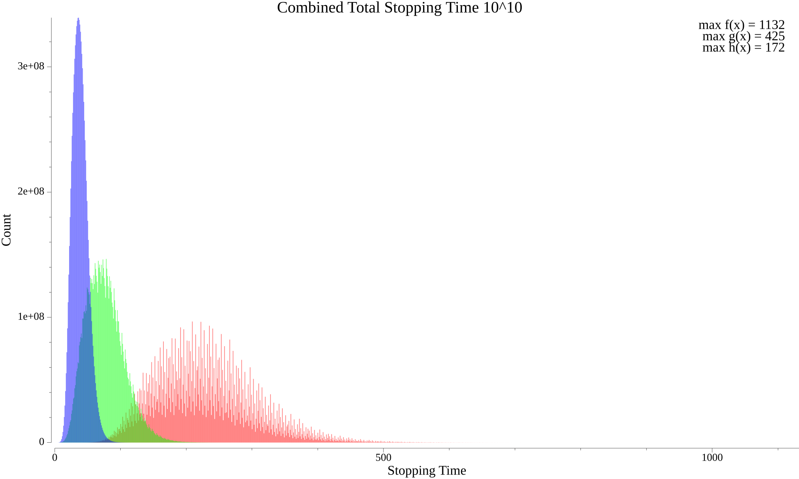
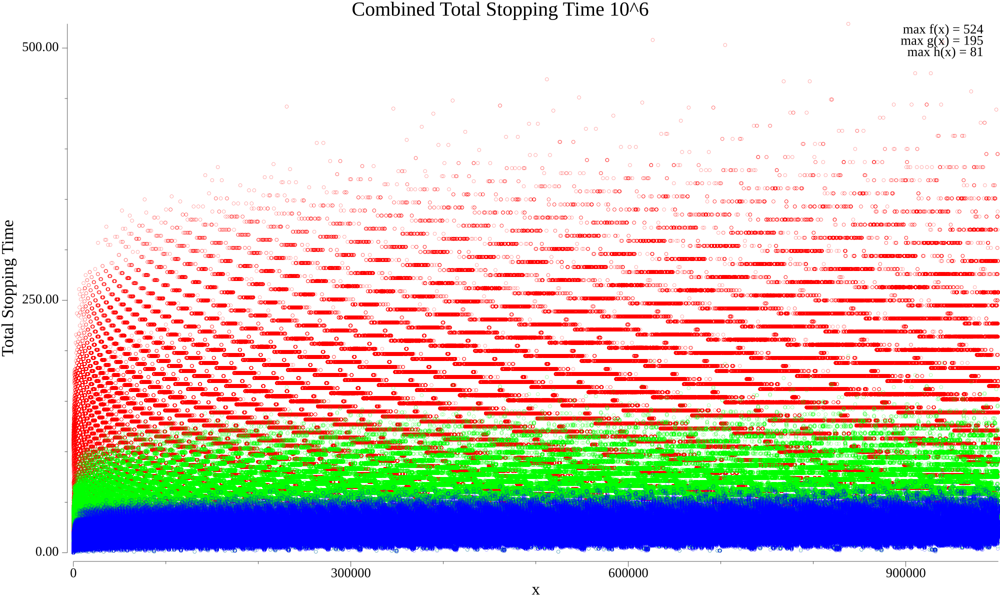
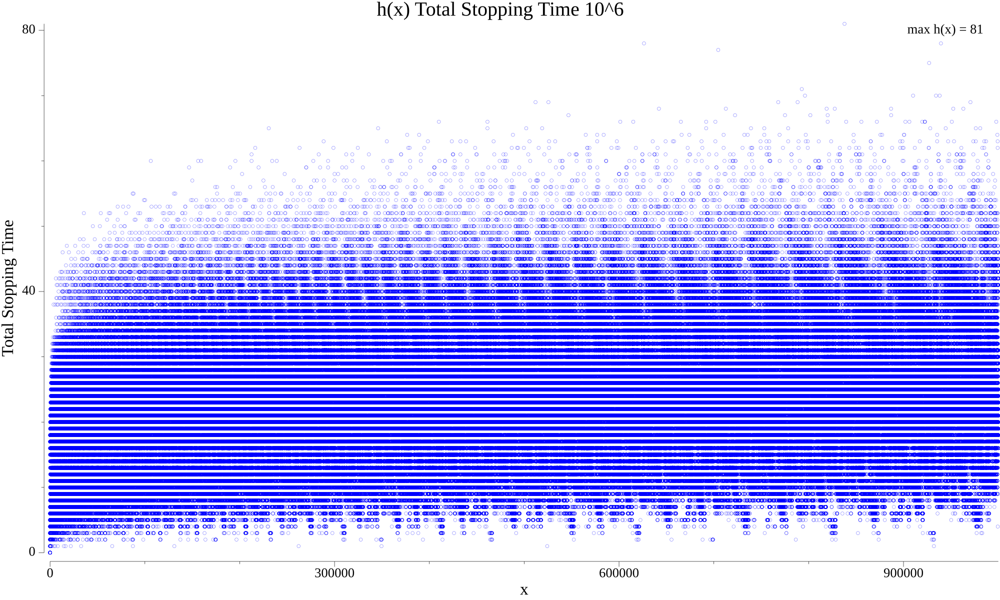
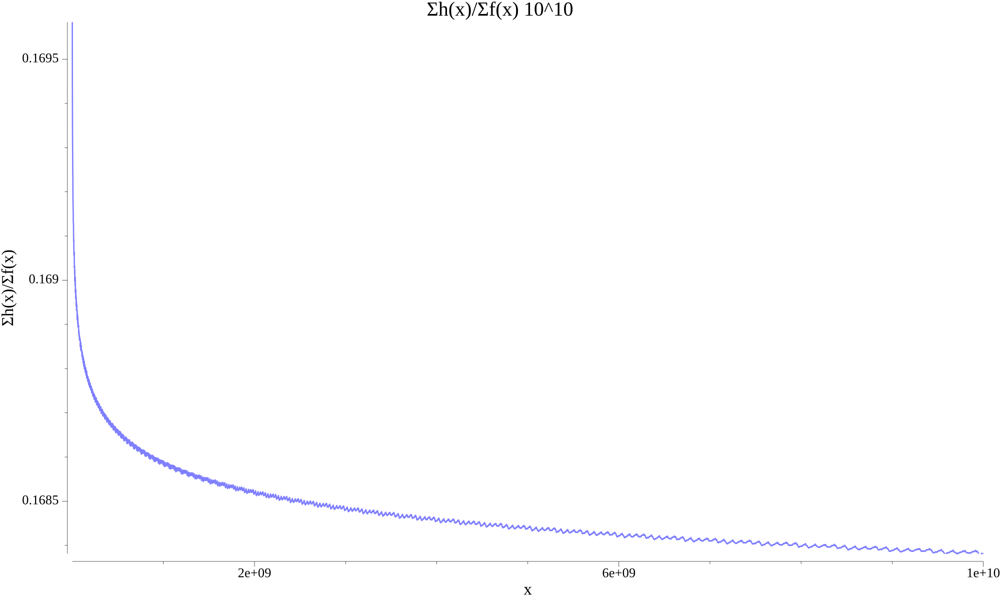
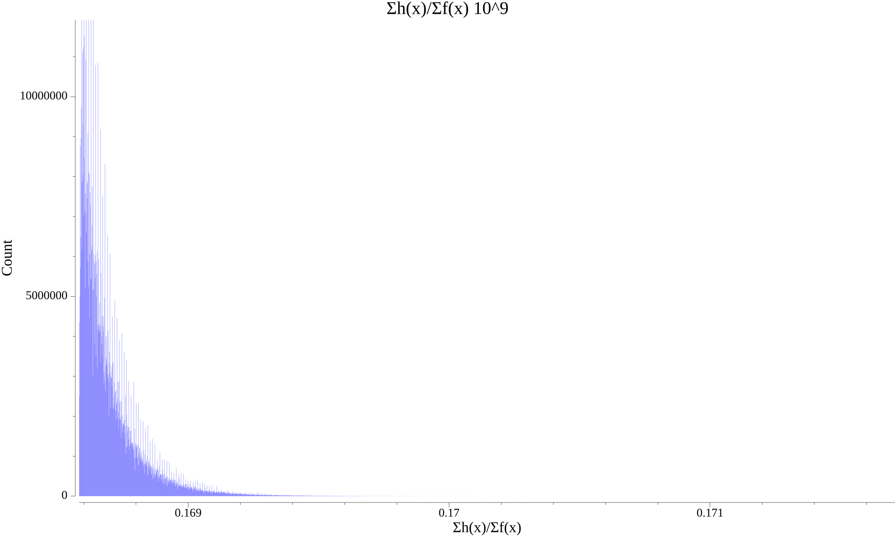
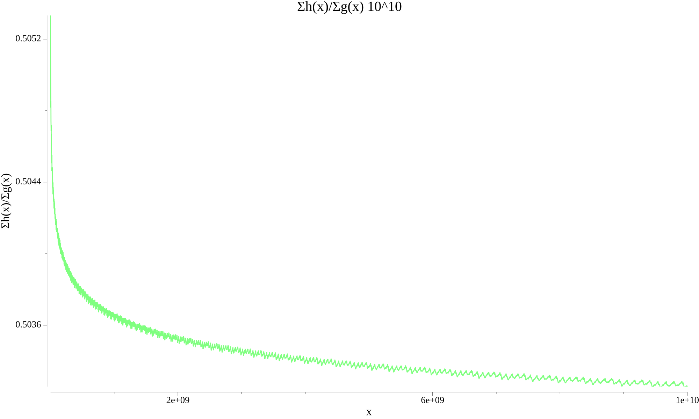
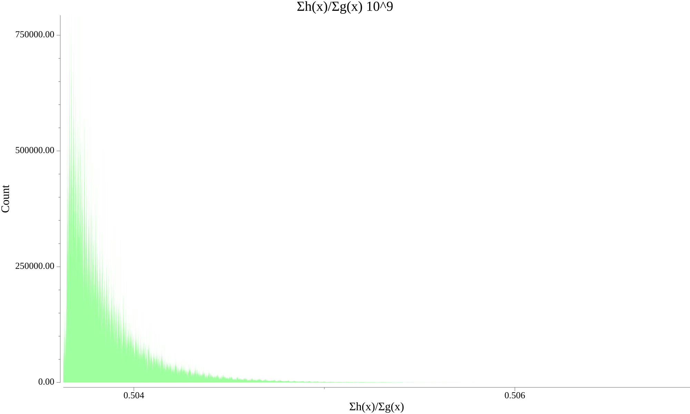

# Optimizing the total stopping time of the Collatz conjecture

Author: D. Thériault, 2023

## Abstract

The Collatz conjecture, $3x+1$, is a well-known open problem around the function/mapping $C : \mathbb{N}_1 \to \mathbb{N}_1$.

$$
C(x) = \begin{cases}
x/2 & \text{if } x \text{ is even} \\
3x+1 & \text{if } x \text{ is odd}
\end{cases}
$$

Our main result is a reduced function $R^\prime$ that improves upon the 
existing reduced function $R(x) = (3x+1)/2^m$, where $x$ is odd and $2^m$ is the highest power of 2 that divides $3x+1$.<sup>[1](#references)</sup>

We have observed that it improves the total stopping time/recursion of $C$ by about 1/6 as $x \to \infty$ and the total stopping time/recursion of the reduced function $R$ by about 1/2 as $x \to \infty$.

## Introduction

We define the standard total stopping time as the following recursive function $f : \mathbb{N}_1 \to \mathbb{N}_0$

$$
f(x) = \begin{cases}
0           & \text{if } x = 1 \\
1 + f(C(x)) & \text{otherwise}
\end{cases}
$$

This function halts for all $x$ if and only if the Collatz Conjecture is true. If it does halt, then its values are given by the integer sequence [A006577](https://oeis.org/A006577).

The following is a well-known histogram of $f(x)$ up to $10^{10}$



```sh
bin/collatz time --graph histogram --fn f --k 10 # command to generate above
```

## Reduced Collatz Function R

The reduced Collatz function $R(x) = (3x+1)/2^m$, where $2^m$ is the highest power of 2 that divides $(3x+1)$, is a well-known technique that simplifies the calculation of a Collatz sequence for odd numbers.<sup>[1](#references)</sup> Given an odd positive integer $x$, we move ahead $1+m$ steps in an orbit utilizing $R$.

The recursive function $g : \mathbb{N}_1 \to \mathbb{N}_0$ gives the total stopping time if we utilize $R$.

$$
g(x) = \begin{cases}
0                 & \text{if } x = 1 \\
1 + g(x/2^m)      & \text{if } x \equiv 0 \pmod 2 \\
1 + g(R(x)) & \text{if } x \equiv 1 \pmod 2 \text{ and } x \ne 1
\end{cases}
$$

If the Collatz conjecture is proven true, then this function halts for all $x$ and its values are given by [A286380](https://oeis.org/A286380).

An alternative function $g^\prime$ can be used to compute $f$:

$$
g^\prime(x) = \begin{cases}
0                 & \text{if } x = 1 \\
m + g^\prime(x/2^m)      & \text{if } x \equiv 0 \pmod 2 \\
m + 1 + g^\prime((3x+1)/2^m) & \text{if } x \equiv 1 \pmod 2 \text{ and } x \ne 1
\end{cases}
$$

$$
g^\prime(x) = f(x)
$$

The following is a histogram of $g(x)$ up to $10^{10}$



```sh
bin/collatz time --graph histogram --fn g --k 10 # command to generate above
```

## Main Result

The main result of this paper is the reduced function $R^\prime$, where $\nu_2(x+1)$ is the 2-adic valuation of $x+1$, and where $2^m$ is the highest power of 2 dividing the numerator. It jumps ahead $2\cdot\nu_2(x+1) + m$ steps in an orbit per iteration.

$$
R^\prime(x) = ((3/2)^{\nu_2(x+1)} (x+1) - 1)/2^m
$$

The recursive function $g : \mathbb{N}_1 \to \mathbb{N}_0$ gives the total stopping time utilizing $R^\prime$.

$$
h(x) = \begin{cases}
0                      & \text{if } x = 1 \\
1 + h(R^\prime(x))     & \text{otherwise}
\end{cases}
$$

If the Collatz conjecture is true, then this function halts for all $x$ and its values appear to be given by [A160541](https://oeis.org/A160541).

The following is a histogram of $h(x)$ up to $10^{10}$



```sh
bin/collatz time --graph histogram --fn h --k 10 # command to generate above
```

When we combine the histograms of $f(x)$, $g(x)$, and $h(x)$, the improvements become empirically evident.



```sh
bin/collatz time --graph histogram --k 10 # command to generate above
```

A combined scatter plot with $x$ along the x-axis and the values of $f(x), g(x), h(x)$ along the y-axis.



```sh
bin/collatz time --graph scatter --k 6 # command to generate above
```

If we examine only $h(x)$:



```sh
bin/collatz time --graph scatter --fn h --k 6 # command to generate above
```

While a rigorous proof of $R^\prime$ would be important, we currently do not provide one here. However, one can
recover $f$ using the following variation $h^\prime$, where $2^m$ is the highest power of 2 that divides the 
numerator, and $\nu_2(x+1)$ is the 2-adic valuation of $x+1$.

$$
h^\prime(x) = \begin{cases}
0                                                        & \text{if } x = 1 \\
m + 2\cdot\nu_2(x+1) + h^\prime\left(\frac{(3/2)^{\nu_2(x+1)} (x+1) - 1}{2^m}\right) & \text{otherwise}
\end{cases}
$$

$$
h^\prime(x) = f(x)
$$

## Ratios

Based on empirical evidence, the summation of $h(x)$ over the summation of $f(x)$ appears to approach $1/6$.



```sh
bin/collatz ratios --graph line --fn f --k 10 --group=1000000 # command to generate above for 10^10 by plotting every millionth ratio
```



```sh
bin/collatz ratios --graph histogram --fn f --k 9 --group=1000000
```

The ratio between the summation of $h(x)$ over the summation of $g(x)$ appears to approach $1/2$.



```sh
bin/collatz ratios --graph line --fn g --k 10 --group=1000000 # command to generate above for 10^10 by plotting every millionth ratio
```



```sh
bin/collatz ratios --graph histogram --fn g --k 9 --group=10000000
```

# Acknowledgements

- [K. Ryde](https://oeis.org/wiki/User:Kevin_Ryde) for improvements and reference to [A085062](https://oeis.org/A085062)
- [OEIS community](https://oeis.org/)
 
# References

- Livio Colussi. Some contributions to Collatz conjecture. https://doi.org/10.48550/arXiv.1703.03918
- J. C. Lagarias and N. J. A. Sloane, Approximate squaring, Experimental Math., 13 (2004), 113-128. https://doi.org/10.48550/arXiv.math/0309389